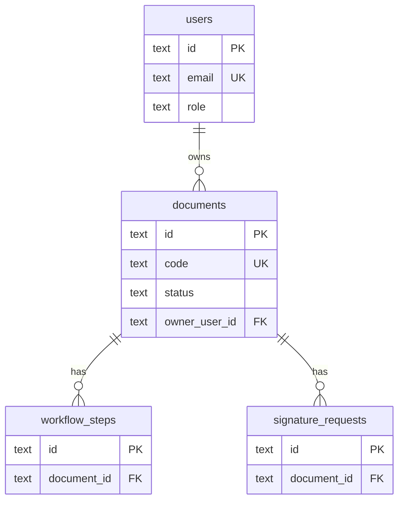

# baseline-.md

Version-controlled documentation baseline for the **GxP Toolkit** reusable AI-agent-ready template.

This file is the sole Markdown deliverable for template preparation work. Recommended updates to other Markdown and `.mdc` files are recorded under [Proposed Documentation Updates](#proposed-documentation-updates).

---

## 1. Template Identity

| Field | Value |
|-------|-------|
| **Project name** | GxP Toolkit |
| **Purpose** | Reusable Vite + React + TypeScript starter for quality-systems and GxP-oriented web applications |
| **Package name** | `gxp-toolkit` |
| **UI stack** | Custom CSS + Recharts (not Ant Design at runtime) |
| **Data layer (template)** | TypeScript mocks + SQLite schema reference |
| **Future backend** | Supabase PostgreSQL, Auth, RLS, Storage |

Copy this entire folder to start a new project. After copying, update project-specific values listed in [Copy-to-New-Project Checklist](#8-copy-to-new-project-checklist).

---

## For project owners (read this first)

When you copy this template, you only need to update **`baseline-.md`** with what you want to build:

- Project name and purpose
- User roles and permissions
- Pages and modules to keep or remove
- Database tables and relationships (extend `database/sqlite/schema.sql`)
- Deployment target (GitHub Pages, Supabase later, etc.)
- Definition of done for your app

**Do not** duplicate project goals into `agent-workflow/agent-history/version-0-baseline.md` — that file holds template-invariant workflow rules only.

Agents read `baseline-.md` for your project definition. Agents update `HANDOFF.md` and `PLAN.md` during work sessions.

| Mechanism | In agent workflow? | Reference |
|-----------|-------------------|-----------|
| Handoff | Yes — required | `agent-workflow/DOX.md`, `HANDOFF.md` |
| Version control | Partial — commit hash in HANDOFF; `.env.example` committed | `DOX.md` § Version control |
| Rollback | Manual only — Git, env restore, CI re-run, Supabase CLI (future) | `DOX.md` § Rollback and recovery |
| Env / secrets | `.env.example` in repo; `.env.local` gitignored; CI secrets in GitHub Actions | `.env.example`, `DOX.md` § Version control |

SQL `workflow_steps` is document approval routing in the sample app, not agent session steps.

---

## 2. Agent Reading Order

All AI agents (Codex, Cursor, future agents) must follow this order before editing:

```text
AGENTS.md (root redirect)
↓
agent-workflow/AGENTS.md
↓
agent-workflow/DOX.md
↓
agent-workflow/HANDOFF.md
↓
agent-workflow/PLAN.md
↓
baseline-.md (this file)
↓
.cursor/rules/ (graphify.mdc, project-workflow.mdc when approved)
↓
Graphify codebase map (graphify-out/)
↓
SQLite schema map (sqlite-out/)
↓
SQLite source SQL (database/sqlite/)
```

When architecture, constraints, or definition-of-done questions arise, also read:

```text
agent-workflow/agent-history/version-0-baseline.md
```

When touching data models or services, read in this order:

```text
sqlite-out/SCHEMA_REPORT.md
sqlite-out/schema.json
database/sqlite/schema.sql
database/sqlite/seed.sql
src/types/
src/data/
src/services/
```

### Agent maintenance rule (schema changes)

When changing `src/types/`, `src/data/`, `src/services/`, or any data model:

1. Update `database/sqlite/schema.sql` (and `seed.sql` when sample data changes).
2. Run `npm run db:map` to regenerate `sqlite-out/`.
3. Run `npm run db:update` when the `sqlite3` CLI is available (applies SQL to `dev.db` plus map).
4. Verify TypeScript mocks and services still align with the schema map.

Do **not** edit `sqlite-out/` by hand — it is generated output, like `graphify-out/`.

---

## 3. Layered Source-of-Truth Model

| Layer | Authority | Use for |
|-------|-----------|---------|
| **TypeScript source + tests** | Runtime correctness | Behavior, bugs, UI logic |
| **Graphify** (`graphify-out/`) | Codebase architecture map for agents | Folder structure, imports, dependencies, impact analysis |
| **SQLite map** (`sqlite-out/`) | Generated schema relationship map for agents | Tables, columns, FKs, indexes, CHECK constraints, ER diagram |
| **SQLite SQL** (`database/sqlite/`) | Editable schema and seed source | Authoritative SQL for local dev DB and Supabase migration planning |
| **agent-workflow/agent-history/version-0-baseline.md** | Permanent approved constraints | Architecture decisions requiring owner approval |
| **agent-workflow/HANDOFF.md** | Current session state | Verification results, known issues, next steps |

**Rule:** Graphify is the primary **codebase** map for agents. `sqlite-out/` is the primary **schema** map for agents. `database/sqlite/*.sql` is the editable source. Always verify critical claims against source code before editing.

---

## 4. SQLite as Agent Schema Reference

### Purpose

SQLite in this template is:

- A local development database reference (`dev.db`, optional)
- An AI-agent-readable schema and relationship guide (`sqlite-out/`)
- An editable SQL source for schema and seed data (`database/sqlite/`)
- A migration preparation layer for Supabase PostgreSQL

The React app uses mock services in `src/services/` by default. SQLite is **not** wired into the frontend in v1.

### Generated schema map (`sqlite-out/`)

Regenerate with `npm run db:map` (no `sqlite3` CLI required):

```text
sqlite-out/
├── schema.json       # Structured graph: nodes (tables), edges (FKs), columns, indexes
├── SCHEMA_REPORT.md  # Agent-readable report with tables, relationships, mermaid ER
└── schema-map.html   # Self-contained HTML visualization
```

`sqlite-out/` is gitignored. Agents regenerate locally after schema edits.

**Agent rule:** After Graphify, when touching data models, services, or types, read `sqlite-out/SCHEMA_REPORT.md` and `sqlite-out/schema.json` before editing. Then confirm against `database/sqlite/schema.sql`.

### npm scripts

| Script | Purpose | Requires sqlite3 CLI |
|--------|---------|----------------------|
| `npm run db:map` | Parse `schema.sql` and write `sqlite-out/` | No |
| `npm run db:init` | Apply `schema.sql` + `seed.sql` to `dev.db` | Yes (skips gracefully if missing) |
| `npm run db:update` | Run `db:map`; then `db:init` when CLI available | Partial |
| `npm run db:reset` | Delete `dev.db` and re-init | Yes (skips gracefully if missing) |

### When to regenerate

Run `npm run db:map` (or `npm run db:update`) after:

- Adding, renaming, or removing tables or columns in `schema.sql`
- Changing foreign keys, indexes, or CHECK constraints
- Updating seed data structure in `seed.sql`
- Aligning `src/types/` or mock data with a new schema shape

Run `npm run graphify:update` separately when **code structure** changes (routes, imports, services layout) — not for schema-only edits.

### Schema version

Current version: **1** (see `schema_migrations` table).

### Entity relationship



### Tables

| Table | Maps from | Description |
|-------|-----------|-------------|
| `schema_migrations` | meta | Tracks applied schema versions |
| `users` | `AuthUser` in `src/types/auth.ts` | App user profiles and roles |
| `documents` | `DocumentRecord` in `src/types/documents.ts` | Controlled documents |
| `workflow_steps` | `WorkflowStep` | Approval/review steps per document |
| `signature_requests` | `SignatureRequest` | E-signature requests per document |

### Column conventions

| Convention | SQLite | TypeScript / Supabase |
|------------|--------|----------------------|
| IDs | `TEXT` PK | `string` → PostgreSQL `uuid` |
| Dates | ISO 8601 `TEXT` | `string` → `date` or `timestamptz` |
| Booleans | `INTEGER` 0/1 | `boolean` → PostgreSQL `boolean` |
| Status enums | `TEXT` + `CHECK` | Union types → PostgreSQL `enum` or constrained `text` |
| Naming | `snake_case` | `camelCase` via service mapping layer |

### TypeScript mapping example

```typescript
// SQLite row → DocumentRecord
function mapDocument(row: DocumentRow): DocumentRecord {
  return {
    id: row.id,
    code: row.code,
    title: row.title,
    category: row.category,
    owner: row.owner,
    version: row.version,
    status: row.status as DocumentStatus,
    effectiveDate: row.effective_date,
    reviewDate: row.review_date,
    expiryDate: row.expiry_date ?? undefined,
    controlledCopy: row.controlled_copy === 1,
  }
}
```

### Local database commands

```bash
npm run db:map     # Generate sqlite-out/ from schema.sql (always works)
npm run db:update  # db:map + db:init when sqlite3 CLI available
npm run db:init    # Apply schema.sql + seed.sql to database/sqlite/dev.db
npm run db:reset   # Delete dev.db and re-init
```

If the `sqlite3` CLI is not on PATH (common on Windows), `db:map` still works. Use `sqlite-out/` and `database/sqlite/*.sql` as the agent schema reference.

### Future SQLite service adapter

Implement repository interfaces without changing pages:

```typescript
// src/services/sqliteDocumentService.ts (future)
export const sqliteDocumentService: DocumentRepository = {
  async list() { /* query documents table */ },
  async create(document) { /* INSERT */ },
}
```

Swap `mockDocumentService` for `sqliteDocumentService` in page imports when ready.

---

## 5. Supabase Migration Guide

### When to migrate

Migrate to Supabase when the project needs:

- Online PostgreSQL database
- Authentication (Supabase Auth)
- Row Level Security (RLS)
- Storage (file uploads)
- Realtime subscriptions
- Cloud deployment support

### Folder structure (future)

```text
supabase/
├── migrations/          # PostgreSQL migration SQL (stub exists)
└── config.toml          # Supabase CLI config (add when initializing)
```

### SQLite → PostgreSQL type mapping

| SQLite | PostgreSQL | Notes |
|--------|------------|-------|
| `TEXT` (id) | `uuid` | Use `gen_random_uuid()` for new rows |
| `TEXT` | `text` | Direct mapping |
| `INTEGER` (0/1) | `boolean` | `controlled_copy` |
| `TEXT` + CHECK | `enum` or `text` + constraint | Document/signature status |
| `datetime('now')` | `timestamptz` | Use `now()` default |

### Auth model

1. **Supabase Auth** manages credentials in `auth.users`.
2. **App profiles** table (`public.profiles`) extends auth with `role`, `name`, `initials`.
3. Replace `authService` mock login with `supabase.auth.signInWithPassword`.
4. Map `UserRole` to JWT claims or profile lookup for RLS.

### Service swap pattern

Existing interfaces in `src/services/` allow backend replacement:

| Interface | Mock | Supabase target |
|-----------|------|-----------------|
| `DocumentRepository` | `mockDocumentService` | `supabaseDocumentService` |
| `authService` | localStorage + mockUsers | Supabase Auth + profiles |

### RLS checklist (apply per table)

- [ ] Enable RLS on all public tables
- [ ] `users` / `profiles`: users read own row; admins read all
- [ ] `documents`: owner and assigned workflow roles can read; admins full access
- [ ] `workflow_steps`: assignee and document owner can read/update assigned steps
- [ ] `signature_requests`: recipient can read/update own requests
- [ ] Never expose service role key in frontend

### Environment variables

Template files at repository root:

| File | Committed? | Purpose |
|------|------------|---------|
| `.env.example` | Yes | Documented placeholders for all `VITE_*` vars |
| `.env.local` | No (gitignored) | Local dev values — copy from `.env.example` |

```bash
cp .env.example .env.local        # Unix/macOS
copy .env.example .env.local      # Windows
```

```env
VITE_SUPABASE_URL=https://your-project.supabase.co
VITE_SUPABASE_ANON_KEY=your-anon-key
VITE_APP_ENV=development
# VITE_GITHUB_PAGES=true          # optional — CI sets this for Pages builds
```

Only `VITE_*` prefixed vars are inlined at build time. Service role key is **server-side only**.

Type definitions: `src/vite-env.d.ts`.

### CI/CD secrets (GitHub Actions)

Configure in repository **Settings → Secrets and variables → Actions**:

| Secret | Required for template? | Notes |
|--------|------------------------|-------|
| `VITE_SUPABASE_URL` | No (mock-only builds work without) | Public URL; embedded in client bundle |
| `VITE_SUPABASE_ANON_KEY` | No | Public anon key; embedded in client bundle |

Workflow: `.github/workflows/deploy-github-pages.yml` passes these at build time. Never add the service role key.

**Rollback:** revert the deploy commit and push, or re-run a prior successful workflow from Actions history. Restore local `.env.local` from `.env.example` after bad env edits.

### Migration path

1. Translate `database/sqlite/schema.sql` to PostgreSQL (uuid, boolean, timestamptz).
2. Add migration file in `supabase/migrations/`.
3. Convert `seed.sql` INSERTs or use Supabase seed scripts.
4. Run `supabase db push` or apply via SQL editor.
5. Implement Supabase service adapters.
6. Add `verify:supabase` npm script when Supabase CLI is configured.

### Official references (study only)

- https://supabase.com/docs/guides/database/overview
- https://supabase.com/docs/guides/auth
- https://supabase.com/docs/guides/database/postgres/row-level-security

---

## 6. GitHub Pages Deployment Guide

### Current compatibility

| Setting | File | Value | Purpose |
|---------|------|-------|---------|
| Base path | `vite.config.ts` | `base: './'` | Relative asset URLs |
| Router | `src/main.tsx` | `HashRouter` | No server rewrite rules needed |

### Deployment workflow

GitHub Actions workflow: `.github/workflows/deploy-github-pages.yml`

**Setup steps:**

1. Push repository to GitHub.
2. Repository Settings → Pages → Build and deployment → Source: **GitHub Actions**.
3. Push to `master` triggers build and deploy.
4. Site URL: `https://<username>.github.io/<repo-name>/`

### Local verification

```bash
npm run build
npm run preview
```

Test hash routes: `/#/`, `/#/documents`, `/#/settings`.

### Environment variables at build time

Only `VITE_*` variables are embedded in the static bundle. Do not put secrets in GitHub Actions env vars exposed to the frontend build.

The workflow reads optional repository secrets `VITE_SUPABASE_URL` and `VITE_SUPABASE_ANON_KEY`. Mock-only template builds succeed with empty values. See `.env.example` for the full variable list.

### Custom domain

Optional. Configure in GitHub Pages settings after initial deploy.

---

## 7. Graphify Integration Guide

### Install

```powershell
py -m pip install --upgrade --user graphifyy
py -m pip show graphifyy
```

### npm scripts

```bash
npm run graphify:check     # Check if graph is current
npm run graphify:update    # Regenerate graphify-out/
npm run graphify:benchmark # Benchmark graph performance
```

### Output location

```text
graphify-out/
├── graph.json
├── graph.html
└── GRAPH_REPORT.md
```

`graphify-out/` is gitignored. Agents regenerate locally.

### Agent usage patterns

| Task | Command |
|------|---------|
| Impact before edit | `graphify affected "<symbol>" --depth 2` |
| Route/service trace | `graphify path "<nodeA>" "<nodeB>"` |
| Symbol explanation | `graphify explain "<symbol>"` |
| Architecture overview | Read `graphify-out/GRAPH_REPORT.md` |
| Focused query | `graphify query "<question>" --budget 800` |

### When to refresh

Run `npm run graphify:update` after:

- Adding or removing routes, pages, services, or hooks
- Structural refactors affecting imports
- Adding new top-level folders with TypeScript files

### Authority model

Graphify is the **authoritative codebase map for agents**. Source code is the **correctness authority**. Never treat `graphify-out/` as editable source.

---

## 8. Copy-to-New-Project Checklist

After copying this template:

- [ ] Update **`baseline-.md` only** with your project definition
- [ ] Update `package.json` name and version
- [ ] Update `agent-workflow/HANDOFF.md` and `agent-workflow/PLAN.md`
- [ ] Replace sample routes, sidebar menus, and page content
- [ ] Extend `database/sqlite/schema.sql` for your domain tables
- [ ] Run `npm run db:map` to generate `sqlite-out/` schema map
- [ ] Run `npm run db:init` to create local reference DB (when sqlite3 CLI available)
- [ ] Run `npm run graphify:update` for fresh codebase map
- [ ] Configure GitHub Pages workflow for your repository
- [ ] Add Supabase only when online backend is needed
- [ ] Run `npm run verify:schema` after schema or mock changes

**First prompt after copy:**

```text
Read and execute AGENTS.md. This folder was copied from the GxP Toolkit template.
Update project documentation to match this new project. Preserve the Codex-first,
Cursor-second workflow with Graphify and SQLite schema mapping.
```

---

## 9. Bugs found and prevention rules

### Fixed (2026-06-16)

| Issue | Risk | Fix |
|-------|------|-----|
| Legacy `northstar-*` localStorage keys | Stale session/theme after rebrand | Renamed to `gxp-toolkit-user` and `gxp-toolkit-theme` |
| Dual baseline docs | Agents edit wrong file | **Owners update `baseline-.md` only** |
| Docs claimed Ant Design runtime | Wrong stack assumptions | README and rules state custom CSS + Recharts |
| Mock data vs SQL drift | Schema map out of sync | `npm run verify:schema` |
| No generated schema map | Agents miss FK relationships | `sqlite-out/` via `npm run db:map` |

### Agent rules to prevent recurrence

1. After data model changes: update SQL, then `npm run db:map`, then `npm run verify:schema`.
2. Never edit `graphify-out/` or `sqlite-out/` by hand.
3. Never put project-specific goals in `version-0-baseline.md`.
4. Verify map claims against source before editing.

Documentation and rules updated: `AGENTS.md`, `agent-workflow/*`, `README.md`, `.cursor/rules/*`.

---

## 11. eDoc Module Rollout

### Scope

**eDoc** (Electronic Document routing) is a third application module alongside VRMS and VMP. It handles controlled PDF upload, routing, review/approval/signature/acknowledgment, audit trail, and reports.

| Use VRMS | Use eDoc |
|----------|----------|
| Legacy validation routing tracker / signatory matrix (spreadsheet-era workflow) | PDF-native controlled documents with field placement and electronic signature events |
| Existing VRMS production CSV data | New documents created in eDoc after go-live |

### Menu and routes

Sidebar group **`eDoc`** is defined in `src/config/navigationRegistry.ts` (11 submenu items). Routes are protected by `MenuPermissionRoute` in `src/app/routes.tsx`.

### SQLite reference (Phase 1)

| File | Role |
|------|------|
| `database/sqlite/edoc_schema.sql` | Editable SQLite reference for all `edoc_*` tables (mirrors Supabase migration) |
| `database/sqlite/edoc_seed.sql` | Non-production pilot fixtures for local agent validation |
| `npm run db:map` | Regenerates `sqlite-out/` including eDoc tables |
| `npm run verify:edoc-sqlite` | Static + optional live FK/seed validation |

**Rule:** Design or change eDoc tables in `edoc_schema.sql` first; derive or update `supabase/migrations/20260704100000_edoc_supabase_module.sql` from the validated SQLite reference.

### Supabase staging (Phase 2)

| Artifact | Path |
|----------|------|
| Migration | `supabase/migrations/20260704100000_edoc_supabase_module.sql` |
| RLS validation | `supabase/scripts/verify_edoc_rls.sql` |
| Edge Functions | `edoc-file-access`, `edoc-sign-document`, `edoc-create-certificate` |
| Staging checklist | `docs/edoc/STAGING_CHECKLIST.md` |

Apply order documented in `docs/edoc/SETUP.md` and `docs/edoc/STAGING_CHECKLIST.md`.

### Permissions

Default role grants give **view-only** on eDoc menus for non-admin roles. Grant `create`, `edit`, `approve`, and `export` per menu in **User Management** before pilot users sign documents.

### Definition of done (eDoc pilot)

- [ ] SQLite reference passes `npm run verify:edoc-sqlite`
- [ ] Staging migration applied; `verify_edoc_rls.sql` passes
- [ ] Edge Functions deployed; storage buckets private
- [ ] Pilot org membership and menu permissions configured
- [ ] Browser smoke: create → route → inbox → workspace (staging)
- [ ] Owner sign-off before production traffic

### Deferred (not pilot blockers)

- PDF.js canvas preview and stamping signatures into source PDF
- Email reminders / escalations
- Administrative write UI for eDoc configuration

See `docs/edoc/IMPLEMENTATION_PLAN.md` and `docs/edoc/SECURITY.md`.

---

## 10. Implementation Log

Updated: 2026-06-16 (docs alignment + bug prevention)

| Command | Result | Notes |
|---------|--------|-------|
| `npm run verify:schema` | Passed | Mock IDs aligned with seed.sql |
| `npm run db:map` | Passed | 5 tables, 3 FKs, 4 indexes |
| `npm run build` | Passed | |
| `npm run lint` | Passed | |
| `npm run test` | Passed | 3 tests |

### SQLite map generator (2026-06-16)

| Artifact | Path |
|----------|------|
| Generator script | `scripts/generate-sqlite-map.mjs` |
| Init helper | `scripts/db-init.mjs` |
| Update helper | `scripts/db-update.mjs` |
| Generated output | `sqlite-out/schema.json`, `SCHEMA_REPORT.md`, `schema-map.html` |
