# SQLite Schema Report — GxP Toolkit (2026-07-04)

## Summary
- Source: `database/sqlite/schema.sql + database/sqlite/edoc_schema.sql`
- Schema version: **unknown**
- Tables: **24** · Foreign keys: **71** · Indexes: **15**
- Generated: 2026-07-04T07:05:31.801Z

## Agent Usage

Read this file and `sqlite-out/schema.json` after Graphify when touching data models, services, or types.
Regenerate with `npm run db:map` after editing `database/sqlite/schema.sql`.

## Tables

### `profiles`

| Column | Type | Null | PK | Unique | Default | Check | References |
|--------|------|------|----|--------|---------|-------|------------|
| `id` | TEXT | YES | YES |  |  |  |  |
| `auth_user_id` | TEXT | YES |  |  |  |  |  |
| `email` | TEXT | NO |  |  |  |  |  |
| `display_name` | TEXT | NO |  |  |  |  |  |
| `role` | TEXT | NO |  |  | 'viewer' |  |  |
| `active` | INTEGER | NO |  |  | 1 |  |  |

### `app_feedback_messages`

| Column | Type | Null | PK | Unique | Default | Check | References |
|--------|------|------|----|--------|---------|-------|------------|
| `id` | TEXT | YES | YES |  |  |  |  |
| `sender_profile_id` | TEXT | NO |  |  |  |  | `profiles.id` ON DELETE CASCADE |
| `sender_name` | TEXT | NO |  |  |  |  |  |
| `sender_email` | TEXT | NO |  |  |  |  |  |
| `category` | TEXT | NO |  |  |  | `category IN ('improvement', 'bug')` |  |
| `content` | TEXT | NO |  |  |  |  |  |
| `status` | TEXT | NO |  |  | 'unread' | `status IN ('unread', 'read', 'addressed'…` |  |
| `submitted_at` | TEXT | NO |  |  |  |  |  |
| `status_updated_by_profile_id` | TEXT | YES |  |  |  |  | `profiles.id` ON DELETE SET NULL |
| `status_updated_by_name` | TEXT | YES |  |  |  |  |  |
| `status_updated_at` | TEXT | YES |  |  |  |  |  |

**Indexes:**
- `idx_app_feedback_messages_status` (status)
- `idx_app_feedback_messages_sender` (sender_profile_id)

**CHECK constraints:**
- `category IN ('improvement', 'bug')`
- `status IN ('unread', 'read', 'addressed', 'rejected')`

### `vmp_masterlist_records`

| Column | Type | Null | PK | Unique | Default | Check | References |
|--------|------|------|----|--------|---------|-------|------------|
| `id` | TEXT | YES | YES |  |  |  |  |
| `record_id` | TEXT | NO |  | YES |  |  |  |
| `validation_area` | TEXT | NO |  |  |  |  |  |
| `site_plant` | TEXT | NO |  |  |  |  |  |
| `department` | TEXT | NO |  |  |  |  |  |
| `group_name` | TEXT | NO |  |  |  |  |  |
| `room_line` | TEXT | YES |  |  |  |  |  |
| `item_name` | TEXT | NO |  |  |  |  |  |
| `asset_tag_no` | TEXT | YES |  |  |  |  |  |
| `protocol_tracer` | TEXT | YES |  |  |  |  |  |
| `report_tracer` | TEXT | YES |  |  |  |  |  |
| `report_approval_date` | TEXT | YES |  |  |  |  |  |
| `review_frequency` | TEXT | YES |  |  |  |  |  |
| `next_due_date` | TEXT | YES |  |  |  |  |  |
| `validation_status` | TEXT | NO |  |  |  |  |  |
| `lifecycle_status` | TEXT | NO |  |  |  |  |  |
| `criticality` | TEXT | NO |  |  |  |  |  |
| `responsible_owner` | TEXT | YES |  |  |  |  |  |
| `remarks` | TEXT | YES |  |  |  |  |  |
| `is_draft` | INTEGER | NO |  |  | 0 |  |  |
| `is_archived` | INTEGER | NO |  |  | 0 |  |  |
| `version` | INTEGER | NO |  |  | 1 |  |  |
| `created_at` | TEXT | NO |  |  |  |  |  |
| `created_by` | TEXT | NO |  |  |  |  |  |
| `updated_at` | TEXT | NO |  |  |  |  |  |
| `updated_by` | TEXT | NO |  |  |  |  |  |

**Indexes:**
- `idx_vmp_masterlist_record_id` (record_id)
- `idx_vmp_masterlist_validation_area` (validation_area)
- `idx_vmp_masterlist_next_due_date` (next_due_date)
- `idx_vmp_masterlist_is_archived` (is_archived)
- `idx_vmp_masterlist_is_draft` (is_draft)

### `vmp_field_options`

| Column | Type | Null | PK | Unique | Default | Check | References |
|--------|------|------|----|--------|---------|-------|------------|
| `id` | TEXT | YES | YES |  |  |  |  |
| `field_type` | TEXT | NO |  |  |  | `field_type IN ('site_plant', 'group', 'd…` |  |
| `validation_area` | TEXT | YES |  |  |  |  |  |
| `site_id` | TEXT | YES |  |  |  |  |  |
| `department_id` | TEXT | YES |  |  |  |  |  |
| `parent_option_id` | TEXT | YES |  |  |  |  |  |
| `display_value` | TEXT | NO |  |  |  |  |  |
| `normalized_value` | TEXT | NO |  |  |  |  |  |
| `display_order` | INTEGER | NO |  |  | 0 |  |  |
| `is_system_default` | INTEGER | NO |  |  | 0 |  |  |
| `is_user_defined` | INTEGER | NO |  |  | 0 |  |  |
| `is_active` | INTEGER | NO |  |  | 1 |  |  |
| `created_at` | TEXT | NO |  |  |  |  |  |
| `created_by` | TEXT | YES |  |  |  |  |  |
| `updated_at` | TEXT | YES |  |  |  |  |  |
| `updated_by` | TEXT | YES |  |  |  |  |  |

**Indexes:**
- `idx_vmp_field_options_lookup` (field_type, validation_area, site_id, department_id, is_active)

**CHECK constraints:**
- `field_type IN ('site_plant', 'group', 'department', 'room_line')`

### `vmp_qc_instruments`

| Column | Type | Null | PK | Unique | Default | Check | References |
|--------|------|------|----|--------|---------|-------|------------|
| `id` | TEXT | YES | YES |  |  |  |  |
| `masterlist_record_id` | TEXT | NO |  |  |  |  | `vmp_masterlist_records.id` ON DELETE CASCADE |
| `instrument_name` | TEXT | NO |  |  |  |  |  |
| `display_order` | INTEGER | NO |  |  | 0 |  |  |
| `is_active` | INTEGER | NO |  |  | 1 |  |  |
| `created_at` | TEXT | NO |  |  |  |  |  |
| `created_by` | TEXT | NO |  |  |  |  |  |
| `updated_at` | TEXT | NO |  |  |  |  |  |
| `updated_by` | TEXT | NO |  |  |  |  |  |

**Indexes:**
- `idx_vmp_qc_instruments_record` (masterlist_record_id, is_active)

### `edoc_organizations`

| Column | Type | Null | PK | Unique | Default | Check | References |
|--------|------|------|----|--------|---------|-------|------------|
| `id` | TEXT | YES | YES |  |  |  |  |
| `name` | TEXT | NO |  |  |  |  |  |
| `slug` | TEXT | NO |  | YES |  |  |  |
| `created_at` | TEXT | NO |  |  |  |  |  |
| `updated_at` | TEXT | NO |  |  |  |  |  |

### `edoc_organization_members`

| Column | Type | Null | PK | Unique | Default | Check | References |
|--------|------|------|----|--------|---------|-------|------------|
| `id` | TEXT | YES | YES |  |  |  |  |
| `organization_id` | TEXT | NO |  |  |  |  | `edoc_organizations.id` ON DELETE CASCADE |
| `profile_id` | TEXT | NO |  |  |  |  | `profiles.id` ON DELETE CASCADE |
| `department_name` | TEXT | YES |  |  |  |  |  |
| `business_unit_name` | TEXT | YES |  |  |  |  |  |
| `membership_role` | TEXT | NO |  |  | 'member' | `membership_role IN ('owner', 'admin', 'c…` |  |
| `status` | TEXT | NO |  |  | 'active' | `status IN ('active', 'invited', 'suspend…` |  |
| `created_at` | TEXT | NO |  |  |  |  |  |

**CHECK constraints:**
- `membership_role IN ('owner', 'admin', 'controller', 'auditor', 'member')`
- `status IN ('active', 'invited', 'suspended')`

### `edoc_documents`

| Column | Type | Null | PK | Unique | Default | Check | References |
|--------|------|------|----|--------|---------|-------|------------|
| `id` | TEXT | YES | YES |  |  |  |  |
| `organization_id` | TEXT | NO |  |  |  |  | `edoc_organizations.id` |
| `owner_id` | TEXT | NO |  |  |  |  | `profiles.id` |
| `document_number` | TEXT | NO |  |  |  |  |  |
| `title` | TEXT | NO |  |  |  |  |  |
| `description` | TEXT | NO |  |  | '' |  |  |
| `document_type` | TEXT | NO |  |  | '' |  |  |
| `category` | TEXT | NO |  |  | '' |  |  |
| `department_name` | TEXT | NO |  |  | '' |  |  |
| `business_unit_name` | TEXT | NO |  |  | '' |  |  |
| `confidentiality` | TEXT | NO |  |  | 'internal' |  |  |
| `priority` | TEXT | NO |  |  | 'normal' | `priority IN ('low', 'normal', 'high', 'u…` |  |
| `due_at` | TEXT | YES |  |  |  |  |  |
| `retention_class` | TEXT | NO |  |  | '' |  |  |
| `tags` | TEXT | NO |  |  | '[]' |  |  |
| `status` | TEXT | NO |  |  | 'draft' | `status IN (
    'draft', 'preparing', 'r…` |  |
| `current_version_number` | INTEGER | NO |  |  | 1 | `current_version_number > 0` |  |
| `created_at` | TEXT | NO |  |  |  |  |  |
| `updated_at` | TEXT | NO |  |  |  |  |  |
| `lock_version` | INTEGER | NO |  |  | 0 |  |  |

**Indexes:**
- `idx_edoc_documents_org_status` (organization_id, status)
- `idx_edoc_documents_owner` (owner_id, status)

**CHECK constraints:**
- `priority IN ('low', 'normal', 'high', 'urgent')`
- `status IN (
    'draft', 'preparing', 'ready_for_routing', 'in_routing', 'awaiti…`
- `current_version_number > 0`

### `edoc_document_versions`

| Column | Type | Null | PK | Unique | Default | Check | References |
|--------|------|------|----|--------|---------|-------|------------|
| `id` | TEXT | YES | YES |  |  |  |  |
| `organization_id` | TEXT | NO |  |  |  |  | `edoc_organizations.id` |
| `document_id` | TEXT | NO |  |  |  |  | `edoc_documents.id` ON DELETE CASCADE |
| `version_number` | INTEGER | NO |  |  |  | `version_number > 0` |  |
| `status` | TEXT | NO |  |  | 'draft' | `status IN ('draft', 'active', 'supersede…` |  |
| `source_version_id` | TEXT | YES |  |  |  |  | `edoc_document_versions.id` |
| `change_summary` | TEXT | YES |  |  |  |  |  |
| `original_sha256` | TEXT | YES |  |  |  |  |  |
| `final_sha256` | TEXT | YES |  |  |  |  |  |
| `created_by` | TEXT | NO |  |  |  |  | `profiles.id` |
| `created_at` | TEXT | NO |  |  |  |  |  |

**Indexes:**
- `idx_edoc_versions_document` (document_id, version_number)

**CHECK constraints:**
- `version_number > 0`
- `status IN ('draft', 'active', 'superseded', 'completed', 'void')`

### `edoc_document_files`

| Column | Type | Null | PK | Unique | Default | Check | References |
|--------|------|------|----|--------|---------|-------|------------|
| `id` | TEXT | YES | YES |  |  |  |  |
| `organization_id` | TEXT | NO |  |  |  |  | `edoc_organizations.id` |
| `document_id` | TEXT | NO |  |  |  |  | `edoc_documents.id` ON DELETE CASCADE |
| `version_id` | TEXT | NO |  |  |  |  | `edoc_document_versions.id` ON DELETE CASCADE |
| `file_role` | TEXT | NO |  |  |  | `file_role IN ('original', 'revised', 'si…` |  |
| `bucket_id` | TEXT | NO |  |  |  |  |  |
| `object_key` | TEXT | NO |  | YES |  |  |  |
| `file_name` | TEXT | NO |  |  |  |  |  |
| `mime_type` | TEXT | NO |  |  | 'application/pdf' |  |  |
| `size_bytes` | INTEGER | NO |  |  |  | `size_bytes > 0` |  |
| `sha256` | TEXT | YES |  |  |  |  |  |
| `created_by` | TEXT | YES |  |  |  |  | `profiles.id` |
| `created_at` | TEXT | NO |  |  |  |  |  |

**CHECK constraints:**
- `file_role IN ('original', 'revised', 'signed', 'certificate', 'attachment')`
- `size_bytes > 0`

### `edoc_document_access_grants`

| Column | Type | Null | PK | Unique | Default | Check | References |
|--------|------|------|----|--------|---------|-------|------------|
| `id` | TEXT | YES | YES |  |  |  |  |
| `organization_id` | TEXT | NO |  |  |  |  | `edoc_organizations.id` |
| `document_id` | TEXT | NO |  |  |  |  | `edoc_documents.id` ON DELETE CASCADE |
| `grantee_id` | TEXT | NO |  |  |  |  | `profiles.id` |
| `permission_level` | TEXT | NO |  |  |  | `permission_level IN ('view', 'comment', …` |  |
| `granted_by` | TEXT | NO |  |  |  |  | `profiles.id` |
| `expires_at` | TEXT | YES |  |  |  |  |  |
| `created_at` | TEXT | NO |  |  |  |  |  |

**CHECK constraints:**
- `permission_level IN ('view', 'comment', 'edit')`

### `edoc_routing_templates`

| Column | Type | Null | PK | Unique | Default | Check | References |
|--------|------|------|----|--------|---------|-------|------------|
| `id` | TEXT | YES | YES |  |  |  |  |
| `organization_id` | TEXT | NO |  |  |  |  | `edoc_organizations.id` |
| `name` | TEXT | NO |  |  |  |  |  |
| `description` | TEXT | NO |  |  | '' |  |  |
| `mode` | TEXT | NO |  |  |  | `mode IN ('sequential', 'parallel', 'mixe…` |  |
| `created_by` | TEXT | NO |  |  |  |  | `profiles.id` |
| `created_at` | TEXT | NO |  |  |  |  |  |

**CHECK constraints:**
- `mode IN ('sequential', 'parallel', 'mixed')`

### `edoc_document_routes`

| Column | Type | Null | PK | Unique | Default | Check | References |
|--------|------|------|----|--------|---------|-------|------------|
| `id` | TEXT | YES | YES |  |  |  |  |
| `organization_id` | TEXT | NO |  |  |  |  | `edoc_organizations.id` |
| `document_id` | TEXT | NO |  |  |  |  | `edoc_documents.id` ON DELETE CASCADE |
| `version_id` | TEXT | NO |  |  |  |  | `edoc_document_versions.id` |
| `template_id` | TEXT | YES |  |  |  |  | `edoc_routing_templates.id` |
| `mode` | TEXT | NO |  |  |  | `mode IN ('sequential', 'parallel', 'mixe…` |  |
| `status` | TEXT | NO |  |  | 'draft' | `status IN ('draft', 'active', 'completed…` |  |
| `started_at` | TEXT | YES |  |  |  |  |  |
| `completed_at` | TEXT | YES |  |  |  |  |  |
| `created_at` | TEXT | NO |  |  |  |  |  |

**Indexes:**
- `idx_edoc_routes_document` (document_id, status)

**CHECK constraints:**
- `mode IN ('sequential', 'parallel', 'mixed')`
- `status IN ('draft', 'active', 'completed', 'rejected', 'returned', 'cancelled', …`

### `edoc_route_steps`

| Column | Type | Null | PK | Unique | Default | Check | References |
|--------|------|------|----|--------|---------|-------|------------|
| `id` | TEXT | YES | YES |  |  |  |  |
| `organization_id` | TEXT | NO |  |  |  |  | `edoc_organizations.id` |
| `route_id` | TEXT | NO |  |  |  |  | `edoc_document_routes.id` ON DELETE CASCADE |
| `group_id` | TEXT | NO |  |  |  |  |  |
| `sequence` | INTEGER | NO |  |  |  | `sequence > 0` |  |
| `action` | TEXT | NO |  |  |  | `action IN ('review', 'approve', 'sign', …` |  |
| `completion_rule` | TEXT | NO |  |  | 'all' | `completion_rule IN ('all', 'any', 'major…` |  |
| `minimum_count` | INTEGER | YES |  |  |  |  |  |
| `due_at` | TEXT | YES |  |  |  |  |  |
| `allow_delegation` | INTEGER | NO |  |  | 0 |  |  |
| `status` | TEXT | NO |  |  | 'pending' | `status IN ('pending', 'active', 'complet…` |  |
| `created_at` | TEXT | NO |  |  |  |  |  |

**CHECK constraints:**
- `sequence > 0`
- `action IN ('review', 'approve', 'sign', 'acknowledge')`
- `completion_rule IN ('all', 'any', 'majority', 'minimum_count')`
- `status IN ('pending', 'active', 'completed', 'rejected', 'returned', 'skipped', …`

### `edoc_route_step_assignees`

| Column | Type | Null | PK | Unique | Default | Check | References |
|--------|------|------|----|--------|---------|-------|------------|
| `id` | TEXT | YES | YES |  |  |  |  |
| `organization_id` | TEXT | NO |  |  |  |  | `edoc_organizations.id` |
| `route_id` | TEXT | NO |  |  |  |  | `edoc_document_routes.id` ON DELETE CASCADE |
| `step_id` | TEXT | NO |  |  |  |  | `edoc_route_steps.id` ON DELETE CASCADE |
| `assignee_id` | TEXT | NO |  |  |  |  | `profiles.id` |
| `delegated_from_profile_id` | TEXT | YES |  |  |  |  | `profiles.id` |
| `status` | TEXT | NO |  |  | 'pending' | `status IN ('pending', 'active', 'complet…` |  |
| `completed_at` | TEXT | YES |  |  |  |  |  |
| `created_at` | TEXT | NO |  |  |  |  |  |

**Indexes:**
- `idx_edoc_assignments_inbox` (assignee_id, status)

**CHECK constraints:**
- `status IN ('pending', 'active', 'completed', 'rejected', 'returned', 'delegated'…`

### `edoc_route_step_actions`

| Column | Type | Null | PK | Unique | Default | Check | References |
|--------|------|------|----|--------|---------|-------|------------|
| `id` | TEXT | YES | YES |  |  |  |  |
| `organization_id` | TEXT | NO |  |  |  |  | `edoc_organizations.id` |
| `route_id` | TEXT | NO |  |  |  |  | `edoc_document_routes.id` ON DELETE CASCADE |
| `step_id` | TEXT | NO |  |  |  |  | `edoc_route_steps.id` ON DELETE CASCADE |
| `assignment_id` | TEXT | NO |  |  |  |  | `edoc_route_step_assignees.id` |
| `actor_id` | TEXT | NO |  |  |  |  | `profiles.id` |
| `action` | TEXT | NO |  |  |  | `action IN ('review', 'approve', 'sign', …` |  |
| `status` | TEXT | NO |  |  |  | `status IN ('completed', 'rejected', 'ret…` |  |
| `comment` | TEXT | NO |  |  | '' |  |  |
| `reason` | TEXT | YES |  |  |  |  |  |
| `created_at` | TEXT | NO |  |  |  |  |  |

**CHECK constraints:**
- `action IN ('review', 'approve', 'sign', 'acknowledge', 'reject', 'return', 'dele…`
- `status IN ('completed', 'rejected', 'returned', 'delegated', 'cancelled')`

### `edoc_signature_fields`

| Column | Type | Null | PK | Unique | Default | Check | References |
|--------|------|------|----|--------|---------|-------|------------|
| `id` | TEXT | YES | YES |  |  |  |  |
| `organization_id` | TEXT | NO |  |  |  |  | `edoc_organizations.id` |
| `document_id` | TEXT | NO |  |  |  |  | `edoc_documents.id` ON DELETE CASCADE |
| `version_id` | TEXT | NO |  |  |  |  | `edoc_document_versions.id` ON DELETE CASCADE |
| `assignment_id` | TEXT | NO |  |  |  |  | `edoc_route_step_assignees.id` ON DELETE CASCADE |
| `field_type` | TEXT | NO |  |  |  | `field_type IN (
    'signature', 'initia…` |  |
| `page_number` | INTEGER | NO |  |  |  | `page_number > 0` |  |
| `x` | REAL | NO |  |  |  | `x >= 0 AND x <= 1` |  |
| `y` | REAL | NO |  |  |  | `y >= 0 AND y <= 1` |  |
| `width` | REAL | NO |  |  |  | `width > 0 AND width <= 1` |  |
| `height` | REAL | NO |  |  |  | `height > 0 AND height <= 1` |  |
| `required` | INTEGER | NO |  |  | 1 |  |  |
| `created_at` | TEXT | NO |  |  |  |  |  |

**CHECK constraints:**
- `field_type IN (
    'signature', 'initial', 'date_signed', 'name', 'job_title', …`
- `page_number > 0`
- `x >= 0 AND x <= 1`
- `y >= 0 AND y <= 1`
- `width > 0 AND width <= 1`
- `height > 0 AND height <= 1`

### `edoc_signature_events`

| Column | Type | Null | PK | Unique | Default | Check | References |
|--------|------|------|----|--------|---------|-------|------------|
| `id` | TEXT | YES | YES |  |  |  |  |
| `organization_id` | TEXT | NO |  |  |  |  | `edoc_organizations.id` |
| `document_id` | TEXT | NO |  |  |  |  | `edoc_documents.id` |
| `version_id` | TEXT | NO |  |  |  |  | `edoc_document_versions.id` |
| `route_id` | TEXT | NO |  |  |  |  | `edoc_document_routes.id` |
| `step_id` | TEXT | NO |  |  |  |  | `edoc_route_steps.id` |
| `assignment_id` | TEXT | NO |  |  |  |  | `edoc_route_step_assignees.id` |
| `signer_id` | TEXT | NO |  |  |  |  | `profiles.id` |
| `signer_display_name` | TEXT | NO |  |  |  |  |  |
| `signature_meaning` | TEXT | NO |  |  |  |  |  |
| `auth_method` | TEXT | NO |  |  |  |  |  |
| `auth_timestamp` | TEXT | NO |  |  |  |  |  |
| `signing_timestamp` | TEXT | NO |  |  |  |  |  |
| `source_ip` | TEXT | YES |  |  |  |  |  |
| `user_agent` | TEXT | YES |  |  |  |  |  |
| `session_id` | TEXT | YES |  |  |  |  |  |
| `original_pdf_hash` | TEXT | NO |  |  |  |  |  |
| `signed_pdf_hash` | TEXT | YES |  |  |  |  |  |
| `integrity_hash` | TEXT | YES |  |  |  |  |  |
| `created_at` | TEXT | NO |  |  |  |  |  |

### `edoc_completion_certificates`

| Column | Type | Null | PK | Unique | Default | Check | References |
|--------|------|------|----|--------|---------|-------|------------|
| `id` | TEXT | YES | YES |  |  |  |  |
| `organization_id` | TEXT | NO |  |  |  |  | `edoc_organizations.id` |
| `document_id` | TEXT | NO |  |  |  |  | `edoc_documents.id` |
| `version_id` | TEXT | NO |  |  |  |  | `edoc_document_versions.id` |
| `route_id` | TEXT | NO |  |  |  |  | `edoc_document_routes.id` |
| `bucket_id` | TEXT | NO |  |  | 'edoc-certificates' |  |  |
| `object_key` | TEXT | NO |  | YES |  |  |  |
| `verification_code` | TEXT | NO |  | YES |  |  |  |
| `issued_at` | TEXT | NO |  |  |  |  |  |

### `edoc_comments`

| Column | Type | Null | PK | Unique | Default | Check | References |
|--------|------|------|----|--------|---------|-------|------------|
| `id` | TEXT | YES | YES |  |  |  |  |
| `organization_id` | TEXT | NO |  |  |  |  | `edoc_organizations.id` |
| `document_id` | TEXT | NO |  |  |  |  | `edoc_documents.id` ON DELETE CASCADE |
| `version_id` | TEXT | YES |  |  |  |  | `edoc_document_versions.id` |
| `route_step_id` | TEXT | YES |  |  |  |  | `edoc_route_steps.id` |
| `parent_comment_id` | TEXT | YES |  |  |  |  | `edoc_comments.id` ON DELETE CASCADE |
| `author_id` | TEXT | NO |  |  |  |  | `profiles.id` |
| `body` | TEXT | NO |  |  |  | `length(trim(body)) > 0` |  |
| `private` | INTEGER | NO |  |  | 0 |  |  |
| `resolved_at` | TEXT | YES |  |  |  |  |  |
| `created_at` | TEXT | NO |  |  |  |  |  |

**CHECK constraints:**
- `length(trim(body)) > 0`

### `edoc_notifications`

| Column | Type | Null | PK | Unique | Default | Check | References |
|--------|------|------|----|--------|---------|-------|------------|
| `id` | TEXT | YES | YES |  |  |  |  |
| `organization_id` | TEXT | NO |  |  |  |  | `edoc_organizations.id` |
| `recipient_id` | TEXT | NO |  |  |  |  | `profiles.id` |
| `document_id` | TEXT | YES |  |  |  |  | `edoc_documents.id` ON DELETE CASCADE |
| `route_step_id` | TEXT | YES |  |  |  |  | `edoc_route_steps.id` ON DELETE CASCADE |
| `notification_type` | TEXT | NO |  |  |  |  |  |
| `dedupe_key` | TEXT | NO |  |  |  |  |  |
| `title` | TEXT | NO |  |  |  |  |  |
| `body` | TEXT | NO |  |  | '' |  |  |
| `read_at` | TEXT | YES |  |  |  |  |  |
| `created_at` | TEXT | NO |  |  |  |  |  |

### `edoc_audit_events`

| Column | Type | Null | PK | Unique | Default | Check | References |
|--------|------|------|----|--------|---------|-------|------------|
| `id` | TEXT | YES | YES |  |  |  |  |
| `organization_id` | TEXT | NO |  |  |  |  | `edoc_organizations.id` |
| `actor_id` | TEXT | YES |  |  |  |  | `profiles.id` |
| `actor_name` | TEXT | YES |  |  |  |  |  |
| `event_type` | TEXT | NO |  |  |  |  |  |
| `entity_type` | TEXT | NO |  |  |  |  |  |
| `entity_id` | TEXT | YES |  |  |  |  |  |
| `document_id` | TEXT | YES |  |  |  |  | `edoc_documents.id` |
| `version_id` | TEXT | YES |  |  |  |  | `edoc_document_versions.id` |
| `previous_value` | TEXT | YES |  |  |  |  |  |
| `new_value` | TEXT | YES |  |  |  |  |  |
| `reason` | TEXT | YES |  |  |  |  |  |
| `source_ip` | TEXT | YES |  |  |  |  |  |
| `user_agent` | TEXT | YES |  |  |  |  |  |
| `request_id` | TEXT | YES |  |  |  |  |  |
| `source` | TEXT | NO |  |  | 'app' |  |  |
| `integrity_hash` | TEXT | YES |  |  |  |  |  |
| `created_at` | TEXT | NO |  |  |  |  |  |

**Indexes:**
- `idx_edoc_audit_document` (document_id, created_at)

### `edoc_file_access_logs`

| Column | Type | Null | PK | Unique | Default | Check | References |
|--------|------|------|----|--------|---------|-------|------------|
| `id` | TEXT | YES | YES |  |  |  |  |
| `organization_id` | TEXT | NO |  |  |  |  | `edoc_organizations.id` |
| `file_id` | TEXT | NO |  |  |  |  | `edoc_document_files.id` |
| `profile_id` | TEXT | NO |  |  |  |  | `profiles.id` |
| `access_type` | TEXT | NO |  |  |  | `access_type IN ('preview', 'download')` |  |
| `created_at` | TEXT | NO |  |  |  |  |  |

**CHECK constraints:**
- `access_type IN ('preview', 'download')`

### `edoc_settings`

| Column | Type | Null | PK | Unique | Default | Check | References |
|--------|------|------|----|--------|---------|-------|------------|
| `id` | TEXT | YES | YES |  |  |  |  |
| `organization_id` | TEXT | YES |  |  |  |  | `edoc_organizations.id` |
| `setting_key` | TEXT | NO |  |  |  |  |  |
| `setting_value` | TEXT | NO |  |  | '{}' |  |  |
| `updated_at` | TEXT | NO |  |  |  |  |  |

## Relationships

- `app_feedback_messages.sender_profile_id` → `profiles.id` (ON DELETE CASCADE)
- `app_feedback_messages.status_updated_by_profile_id` → `profiles.id` (ON DELETE SET NULL)
- `vmp_field_options.parent_option_id` → `vmp_field_options.id` (ON DELETE SET NULL)
- `vmp_qc_instruments.masterlist_record_id` → `vmp_masterlist_records.id` (ON DELETE CASCADE)
- `edoc_organization_members.organization_id` → `edoc_organizations.id` (ON DELETE CASCADE)
- `edoc_organization_members.profile_id` → `profiles.id` (ON DELETE CASCADE)
- `edoc_documents.organization_id` → `edoc_organizations.id`
- `edoc_documents.owner_id` → `profiles.id`
- `edoc_document_versions.organization_id` → `edoc_organizations.id`
- `edoc_document_versions.document_id` → `edoc_documents.id` (ON DELETE CASCADE)
- `edoc_document_versions.source_version_id` → `edoc_document_versions.id`
- `edoc_document_versions.created_by` → `profiles.id`
- `edoc_document_files.organization_id` → `edoc_organizations.id`
- `edoc_document_files.document_id` → `edoc_documents.id` (ON DELETE CASCADE)
- `edoc_document_files.version_id` → `edoc_document_versions.id` (ON DELETE CASCADE)
- `edoc_document_files.created_by` → `profiles.id`
- `edoc_document_access_grants.organization_id` → `edoc_organizations.id`
- `edoc_document_access_grants.document_id` → `edoc_documents.id` (ON DELETE CASCADE)
- `edoc_document_access_grants.grantee_id` → `profiles.id`
- `edoc_document_access_grants.granted_by` → `profiles.id`
- `edoc_routing_templates.organization_id` → `edoc_organizations.id`
- `edoc_routing_templates.created_by` → `profiles.id`
- `edoc_document_routes.organization_id` → `edoc_organizations.id`
- `edoc_document_routes.document_id` → `edoc_documents.id` (ON DELETE CASCADE)
- `edoc_document_routes.version_id` → `edoc_document_versions.id`
- `edoc_document_routes.template_id` → `edoc_routing_templates.id`
- `edoc_route_steps.organization_id` → `edoc_organizations.id`
- `edoc_route_steps.route_id` → `edoc_document_routes.id` (ON DELETE CASCADE)
- `edoc_route_step_assignees.organization_id` → `edoc_organizations.id`
- `edoc_route_step_assignees.route_id` → `edoc_document_routes.id` (ON DELETE CASCADE)
- `edoc_route_step_assignees.step_id` → `edoc_route_steps.id` (ON DELETE CASCADE)
- `edoc_route_step_assignees.assignee_id` → `profiles.id`
- `edoc_route_step_assignees.delegated_from_profile_id` → `profiles.id`
- `edoc_route_step_actions.organization_id` → `edoc_organizations.id`
- `edoc_route_step_actions.route_id` → `edoc_document_routes.id` (ON DELETE CASCADE)
- `edoc_route_step_actions.step_id` → `edoc_route_steps.id` (ON DELETE CASCADE)
- `edoc_route_step_actions.assignment_id` → `edoc_route_step_assignees.id`
- `edoc_route_step_actions.actor_id` → `profiles.id`
- `edoc_signature_fields.organization_id` → `edoc_organizations.id`
- `edoc_signature_fields.document_id` → `edoc_documents.id` (ON DELETE CASCADE)
- `edoc_signature_fields.version_id` → `edoc_document_versions.id` (ON DELETE CASCADE)
- `edoc_signature_fields.assignment_id` → `edoc_route_step_assignees.id` (ON DELETE CASCADE)
- `edoc_signature_events.organization_id` → `edoc_organizations.id`
- `edoc_signature_events.document_id` → `edoc_documents.id`
- `edoc_signature_events.version_id` → `edoc_document_versions.id`
- `edoc_signature_events.route_id` → `edoc_document_routes.id`
- `edoc_signature_events.step_id` → `edoc_route_steps.id`
- `edoc_signature_events.assignment_id` → `edoc_route_step_assignees.id`
- `edoc_signature_events.signer_id` → `profiles.id`
- `edoc_completion_certificates.organization_id` → `edoc_organizations.id`
- `edoc_completion_certificates.document_id` → `edoc_documents.id`
- `edoc_completion_certificates.version_id` → `edoc_document_versions.id`
- `edoc_completion_certificates.route_id` → `edoc_document_routes.id`
- `edoc_comments.organization_id` → `edoc_organizations.id`
- `edoc_comments.document_id` → `edoc_documents.id` (ON DELETE CASCADE)
- `edoc_comments.version_id` → `edoc_document_versions.id`
- `edoc_comments.route_step_id` → `edoc_route_steps.id`
- `edoc_comments.parent_comment_id` → `edoc_comments.id` (ON DELETE CASCADE)
- `edoc_comments.author_id` → `profiles.id`
- `edoc_notifications.organization_id` → `edoc_organizations.id`
- `edoc_notifications.recipient_id` → `profiles.id`
- `edoc_notifications.document_id` → `edoc_documents.id` (ON DELETE CASCADE)
- `edoc_notifications.route_step_id` → `edoc_route_steps.id` (ON DELETE CASCADE)
- `edoc_audit_events.organization_id` → `edoc_organizations.id`
- `edoc_audit_events.actor_id` → `profiles.id`
- `edoc_audit_events.document_id` → `edoc_documents.id`
- `edoc_audit_events.version_id` → `edoc_document_versions.id`
- `edoc_file_access_logs.organization_id` → `edoc_organizations.id`
- `edoc_file_access_logs.file_id` → `edoc_document_files.id`
- `edoc_file_access_logs.profile_id` → `profiles.id`
- `edoc_settings.organization_id` → `edoc_organizations.id`

## All Indexes

| Index | Table | Columns | Unique |
|-------|-------|---------|--------|
| `idx_app_feedback_messages_status` | `app_feedback_messages` | status |  |
| `idx_app_feedback_messages_sender` | `app_feedback_messages` | sender_profile_id |  |
| `idx_vmp_masterlist_record_id` | `vmp_masterlist_records` | record_id |  |
| `idx_vmp_masterlist_validation_area` | `vmp_masterlist_records` | validation_area |  |
| `idx_vmp_masterlist_next_due_date` | `vmp_masterlist_records` | next_due_date |  |
| `idx_vmp_masterlist_is_archived` | `vmp_masterlist_records` | is_archived |  |
| `idx_vmp_masterlist_is_draft` | `vmp_masterlist_records` | is_draft |  |
| `idx_vmp_field_options_lookup` | `vmp_field_options` | field_type, validation_area, site_id, department_id, is_active |  |
| `idx_vmp_qc_instruments_record` | `vmp_qc_instruments` | masterlist_record_id, is_active |  |
| `idx_edoc_documents_org_status` | `edoc_documents` | organization_id, status |  |
| `idx_edoc_documents_owner` | `edoc_documents` | owner_id, status |  |
| `idx_edoc_versions_document` | `edoc_document_versions` | document_id, version_number |  |
| `idx_edoc_routes_document` | `edoc_document_routes` | document_id, status |  |
| `idx_edoc_assignments_inbox` | `edoc_route_step_assignees` | assignee_id, status |  |
| `idx_edoc_audit_document` | `edoc_audit_events` | document_id, created_at |  |

## Entity Relationship Diagram

```mermaid
erDiagram
  profiles ||--o{ app_feedback_messages : "sender_profile_id"
  profiles ||--o{ app_feedback_messages : "status_updated_by_profile_id"
  vmp_field_options ||--o{ vmp_field_options : "parent_option_id"
  vmp_masterlist_records ||--o{ vmp_qc_instruments : "masterlist_record_id"
  edoc_organizations ||--o{ edoc_organization_members : "organization_id"
  profiles ||--o{ edoc_organization_members : "profile_id"
  edoc_organizations ||--o{ edoc_documents : "organization_id"
  profiles ||--o{ edoc_documents : "owner_id"
  edoc_organizations ||--o{ edoc_document_versions : "organization_id"
  edoc_documents ||--o{ edoc_document_versions : "document_id"
  edoc_document_versions ||--o{ edoc_document_versions : "source_version_id"
  profiles ||--o{ edoc_document_versions : "created_by"
  edoc_organizations ||--o{ edoc_document_files : "organization_id"
  edoc_documents ||--o{ edoc_document_files : "document_id"
  edoc_document_versions ||--o{ edoc_document_files : "version_id"
  profiles ||--o{ edoc_document_files : "created_by"
  edoc_organizations ||--o{ edoc_document_access_grants : "organization_id"
  edoc_documents ||--o{ edoc_document_access_grants : "document_id"
  profiles ||--o{ edoc_document_access_grants : "grantee_id"
  profiles ||--o{ edoc_document_access_grants : "granted_by"
  edoc_organizations ||--o{ edoc_routing_templates : "organization_id"
  profiles ||--o{ edoc_routing_templates : "created_by"
  edoc_organizations ||--o{ edoc_document_routes : "organization_id"
  edoc_documents ||--o{ edoc_document_routes : "document_id"
  edoc_document_versions ||--o{ edoc_document_routes : "version_id"
  edoc_routing_templates ||--o{ edoc_document_routes : "template_id"
  edoc_organizations ||--o{ edoc_route_steps : "organization_id"
  edoc_document_routes ||--o{ edoc_route_steps : "route_id"
  edoc_organizations ||--o{ edoc_route_step_assignees : "organization_id"
  edoc_document_routes ||--o{ edoc_route_step_assignees : "route_id"
  edoc_route_steps ||--o{ edoc_route_step_assignees : "step_id"
  profiles ||--o{ edoc_route_step_assignees : "assignee_id"
  profiles ||--o{ edoc_route_step_assignees : "delegated_from_profile_id"
  edoc_organizations ||--o{ edoc_route_step_actions : "organization_id"
  edoc_document_routes ||--o{ edoc_route_step_actions : "route_id"
  edoc_route_steps ||--o{ edoc_route_step_actions : "step_id"
  edoc_route_step_assignees ||--o{ edoc_route_step_actions : "assignment_id"
  profiles ||--o{ edoc_route_step_actions : "actor_id"
  edoc_organizations ||--o{ edoc_signature_fields : "organization_id"
  edoc_documents ||--o{ edoc_signature_fields : "document_id"
  edoc_document_versions ||--o{ edoc_signature_fields : "version_id"
  edoc_route_step_assignees ||--o{ edoc_signature_fields : "assignment_id"
  edoc_organizations ||--o{ edoc_signature_events : "organization_id"
  edoc_documents ||--o{ edoc_signature_events : "document_id"
  edoc_document_versions ||--o{ edoc_signature_events : "version_id"
  edoc_document_routes ||--o{ edoc_signature_events : "route_id"
  edoc_route_steps ||--o{ edoc_signature_events : "step_id"
  edoc_route_step_assignees ||--o{ edoc_signature_events : "assignment_id"
  profiles ||--o{ edoc_signature_events : "signer_id"
  edoc_organizations ||--o{ edoc_completion_certificates : "organization_id"
  edoc_documents ||--o{ edoc_completion_certificates : "document_id"
  edoc_document_versions ||--o{ edoc_completion_certificates : "version_id"
  edoc_document_routes ||--o{ edoc_completion_certificates : "route_id"
  edoc_organizations ||--o{ edoc_comments : "organization_id"
  edoc_documents ||--o{ edoc_comments : "document_id"
  edoc_document_versions ||--o{ edoc_comments : "version_id"
  edoc_route_steps ||--o{ edoc_comments : "route_step_id"
  edoc_comments ||--o{ edoc_comments : "parent_comment_id"
  profiles ||--o{ edoc_comments : "author_id"
  edoc_organizations ||--o{ edoc_notifications : "organization_id"
  profiles ||--o{ edoc_notifications : "recipient_id"
  edoc_documents ||--o{ edoc_notifications : "document_id"
  edoc_route_steps ||--o{ edoc_notifications : "route_step_id"
  edoc_organizations ||--o{ edoc_audit_events : "organization_id"
  profiles ||--o{ edoc_audit_events : "actor_id"
  edoc_documents ||--o{ edoc_audit_events : "document_id"
  edoc_document_versions ||--o{ edoc_audit_events : "version_id"
  edoc_organizations ||--o{ edoc_file_access_logs : "organization_id"
  edoc_document_files ||--o{ edoc_file_access_logs : "file_id"
  profiles ||--o{ edoc_file_access_logs : "profile_id"
  edoc_organizations ||--o{ edoc_settings : "organization_id"
  profiles {
    text id PK
    text auth_user_id
    text email
    text display_name
    text role
    integer active
  }
  app_feedback_messages {
    text id PK
    text sender_profile_id FK
    text sender_name
    text sender_email
    text category
    text content
    text status
    text submitted_at
    text status_updated_by_profile_id FK
    text status_updated_by_name
    text status_updated_at
  }
  vmp_masterlist_records {
    text id PK
    text record_id UK
    text validation_area
    text site_plant
    text department
    text group_name
    text room_line
    text item_name
    text asset_tag_no
    text protocol_tracer
    text report_tracer
    text report_approval_date
    text review_frequency
    text next_due_date
    text validation_status
    text lifecycle_status
    text criticality
    text responsible_owner
    text remarks
    integer is_draft
    integer is_archived
    integer version
    text created_at
    text created_by
    text updated_at
    text updated_by
  }
  vmp_field_options {
    text id PK
    text field_type
    text validation_area
    text site_id
    text department_id
    text parent_option_id
    text display_value
    text normalized_value
    integer display_order
    integer is_system_default
    integer is_user_defined
    integer is_active
    text created_at
    text created_by
    text updated_at
    text updated_by
  }
  vmp_qc_instruments {
    text id PK
    text masterlist_record_id FK
    text instrument_name
    integer display_order
    integer is_active
    text created_at
    text created_by
    text updated_at
    text updated_by
  }
  edoc_organizations {
    text id PK
    text name
    text slug UK
    text created_at
    text updated_at
  }
  edoc_organization_members {
    text id PK
    text organization_id FK
    text profile_id FK
    text department_name
    text business_unit_name
    text membership_role
    text status
    text created_at
  }
  edoc_documents {
    text id PK
    text organization_id FK
    text owner_id FK
    text document_number
    text title
    text description
    text document_type
    text category
    text department_name
    text business_unit_name
    text confidentiality
    text priority
    text due_at
    text retention_class
    text tags
    text status
    integer current_version_number
    text created_at
    text updated_at
    integer lock_version
  }
  edoc_document_versions {
    text id PK
    text organization_id FK
    text document_id FK
    integer version_number
    text status
    text source_version_id FK
    text change_summary
    text original_sha256
    text final_sha256
    text created_by FK
    text created_at
  }
  edoc_document_files {
    text id PK
    text organization_id FK
    text document_id FK
    text version_id FK
    text file_role
    text bucket_id
    text object_key UK
    text file_name
    text mime_type
    integer size_bytes
    text sha256
    text created_by FK
    text created_at
  }
  edoc_document_access_grants {
    text id PK
    text organization_id FK
    text document_id FK
    text grantee_id FK
    text permission_level
    text granted_by FK
    text expires_at
    text created_at
  }
  edoc_routing_templates {
    text id PK
    text organization_id FK
    text name
    text description
    text mode
    text created_by FK
    text created_at
  }
  edoc_document_routes {
    text id PK
    text organization_id FK
    text document_id FK
    text version_id FK
    text template_id FK
    text mode
    text status
    text started_at
    text completed_at
    text created_at
  }
  edoc_route_steps {
    text id PK
    text organization_id FK
    text route_id FK
    text group_id
    integer sequence
    text action
    text completion_rule
    integer minimum_count
    text due_at
    integer allow_delegation
    text status
    text created_at
  }
  edoc_route_step_assignees {
    text id PK
    text organization_id FK
    text route_id FK
    text step_id FK
    text assignee_id FK
    text delegated_from_profile_id FK
    text status
    text completed_at
    text created_at
  }
  edoc_route_step_actions {
    text id PK
    text organization_id FK
    text route_id FK
    text step_id FK
    text assignment_id FK
    text actor_id FK
    text action
    text status
    text comment
    text reason
    text created_at
  }
  edoc_signature_fields {
    text id PK
    text organization_id FK
    text document_id FK
    text version_id FK
    text assignment_id FK
    text field_type
    integer page_number
    real x
    real y
    real width
    real height
    integer required
    text created_at
  }
  edoc_signature_events {
    text id PK
    text organization_id FK
    text document_id FK
    text version_id FK
    text route_id FK
    text step_id FK
    text assignment_id FK
    text signer_id FK
    text signer_display_name
    text signature_meaning
    text auth_method
    text auth_timestamp
    text signing_timestamp
    text source_ip
    text user_agent
    text session_id
    text original_pdf_hash
    text signed_pdf_hash
    text integrity_hash
    text created_at
  }
  edoc_completion_certificates {
    text id PK
    text organization_id FK
    text document_id FK
    text version_id FK
    text route_id FK
    text bucket_id
    text object_key UK
    text verification_code UK
    text issued_at
  }
  edoc_comments {
    text id PK
    text organization_id FK
    text document_id FK
    text version_id FK
    text route_step_id FK
    text parent_comment_id FK
    text author_id FK
    text body
    integer private
    text resolved_at
    text created_at
  }
  edoc_notifications {
    text id PK
    text organization_id FK
    text recipient_id FK
    text document_id FK
    text route_step_id FK
    text notification_type
    text dedupe_key
    text title
    text body
    text read_at
    text created_at
  }
  edoc_audit_events {
    text id PK
    text organization_id FK
    text actor_id FK
    text actor_name
    text event_type
    text entity_type
    text entity_id
    text document_id FK
    text version_id FK
    text previous_value
    text new_value
    text reason
    text source_ip
    text user_agent
    text request_id
    text source
    text integrity_hash
    text created_at
  }
  edoc_file_access_logs {
    text id PK
    text organization_id FK
    text file_id FK
    text profile_id FK
    text access_type
    text created_at
  }
  edoc_settings {
    text id PK
    text organization_id FK
    text setting_key
    text setting_value
    text updated_at
  }
```

